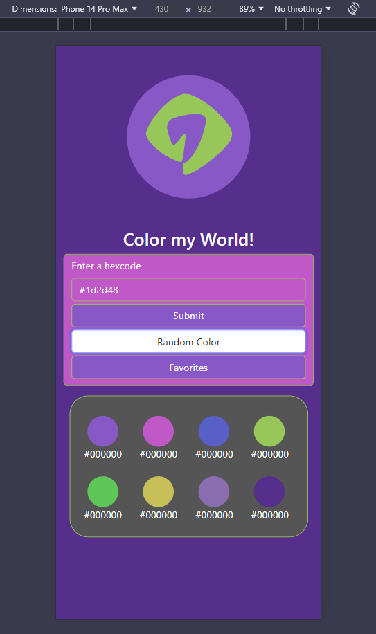

# Color My World

## Table of Contents
* [About The Project](#about-the-project) 
* [Built With](#built-with)
* [Getting Started](#getting-started)
* [Installation](#installation)
* [Usage](#usage)
* [Roadmap](#roadmap)
* [Authors](#authors)

## About The Project

[Link to Google Slides Presentation](https://docs.google.com/presentation/d/1aG3oLjwS4z6qMoSwMT-FuMF9R7yJbeYpalMhjGFj4ZA/edit?usp=sharing)

"It's what it sounds like!" 

Color-My-World is a versatile color generator designed to assist with color selection and matching. The tool allows users to input any color hex code and generates a coordinated palette by calculating adjacent, complementary, triad, light, and dark variations. Additionally, Color-My-World features a random color generator that produces a hex code and automatically generates the same range of color selections from the randomly selected base color. This project is ideal for designers, developers, and anyone looking to explore or refine color schemes for creative work.

Our first bootcamp project is an important step in our software development journey. We are using our newly aquired skills and knowledge to build an application from scratch. Color-My-World is our team's execution of this projects requirements: to conceive and execute a design that solves a real-world problem by storing data received from users in the browser and integrating it into our application. 

We are learning agile development methodologies and implementing feature and bug fixes using Git branch workflow and pull requests. 

### User Story:

* As a web developer, I want to find colors that work well together, so that I can use them to make high quality web designs.

### Acceptance Criteria:

* GIVEN.. a color theme generator web app
* WHEN.. I visit the webpage I see a random color selector button
* THEN..I press the button to get a random color with corresponding colors displayed
* WHEN..I click on the favorites button
* THEN.. I see a grid of color pallet cards
* WHEN..I input my hex code
* THEN..I receive corresponding colors
* WHEN..I visit the webpage I'll see a 2 part circle and polygon logo
* THEN..When I receive my corresponding colors, the logo will transition to those colors.
* WHEN..I submit my color
* THEN..a modal shows my color pallet and asks if I'd like to favorite

## Built With

* Visual Studio Code

* GitBash

* GitHut

* Google Slides

* Hypertext Markup Language

* Cascading Style Sheets

* JavaScript

### Research:
* Color Theory: https://blog.matthewgove.com/2021/07/02/color-theory-a-simple-exercise-in-mathematics-and-graphic-design/

* Hexcodes: https://www.pluralsight.com/blog/tutorials/understanding-hexadecimal-colors-simple

* Converting Color Spaces in JavaScript: https://css-tricks.com/converting-color-spaces-in-javascript/#aa-rgb-to-hsl

## Getting Started
### Follow Link To Deployed Application: [Color My World!](https://mmcgarry13.github.io/Color-My-World/)

* Insert your own hexcode.
--OR--
* Obtain a random hexcode.

* Press 'Submit' to see colors associated with this hexcode. 
* Press 'Favorites' to save these colors to localStorage.

## Installation
* No installation required. 

## Usage

Hexcodes are 6 digit representations of red blue green values for a color in a 16-base number system, where a - f = 11 -16
Using color theory, calculated how to make an 8 color theme from any given base color.
If the user chooses to favorite the newly generated pallet, that theme is saved to local storage and displays at the favorites section at the bottom.
 
 * Use this color theory calculation to display coordinating colors. 

## Roadmap
We initially divided tasks between the three of us.  Matt created the repo and project page and wrote some button and local storage functionality, Tim made a wireframe in google slides and a logo, and polished the css, Josh figured out the color math.
Our next meeting was all about getting a working prototype,  an HTML scaffolding for the functionality.  Once that was established we focused on solving one feature at a time as a group.

We believe we have a good looking app.  It's easy to use, it does what we intend for it to do, and we learned quite a bit about planning and executing said plan. 

## Authors

[Josh Hensley](https://github.com/josh-hensley)

[Matthew Mcgarry](https://github.com/mmcgarry13)

[Timothy Rice](https://github.com/Moth668)